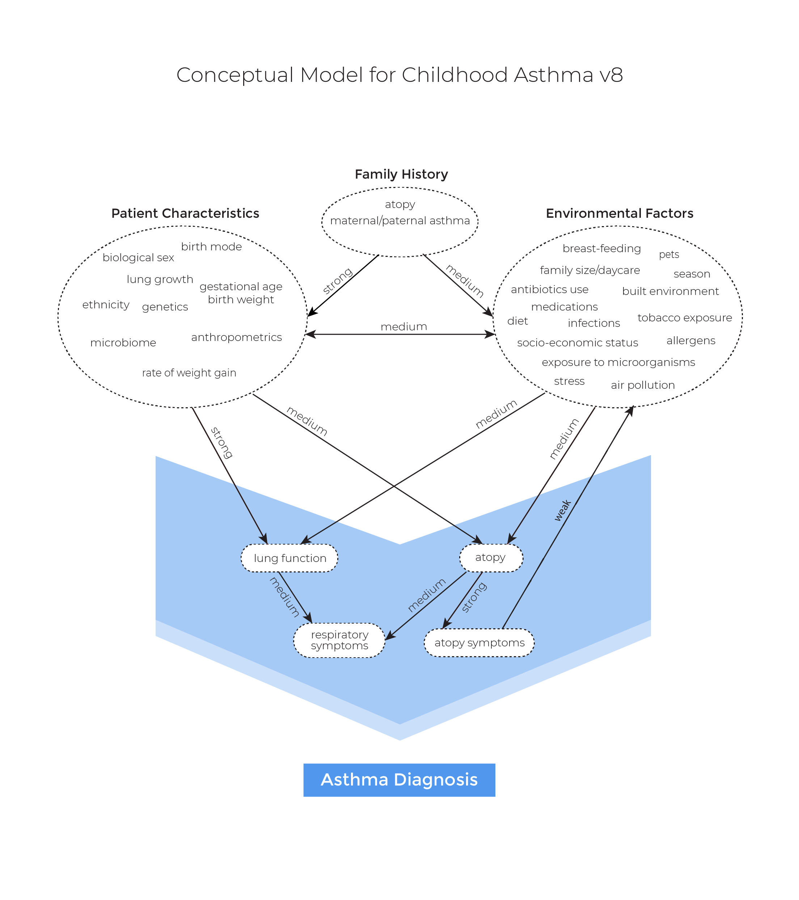

---
title: V1-documentation
output: pdf_document
---  
  
  
#  Conceptual framework
  
Similar to [Evaluation Platform In COPD](https://doi.org/10.1177/0272989X18824098 ) and [Whole Diesase Modeling of Oral Cancer](http://hdl.handle.net/2429/71051 ), we follow the [Whole Disease Modeling framework](https://scholar.google.com/scholar?hl=en&as_sdt=0%2C5&q=Whole+Disease+Modeling+to+Inform+Resource+Allocation+Decisions+in+Cancer%3A+A+Methodological+Framework&btnG= ), in which we model the *entire* course of the disease, from pre-clinical status through a variety of possible events including asthma incidence, asthma exacerbation, and death, and allow multiple decision nodes to interact with each other over time.
  
To model the entire disease pathway, we closely followed the guidelines set by the ISPOR-SMDM Modeling Good Research Practices Task Force and used a concept map (Figure 1) developed by a steering committee of economic modelers, allergists, and respirologists across Canada through a modified Delphi process (details can be found [here](https://www.medrxiv.org/content/10.1101/2020.12.15.20248275v2 )).
  
**Figure 1:** Concept map of childhood asthma.

  
  
  
  
The CHILD asthma model is a microsimulation Markov model with an annual cycle (which was chosen in accordance with recommendations by the concept map committee and with our independent investigation of the optimal framework using the taxonomy and checklist provided by Brennan et al. (2010)). The overall feature of the CHILD asthma model is an open population model that simulates the life trajectory of Canadians from Year 2020 (or later) to future (e.g., Year 2065), including population growth, aging, immigration, and emigration. The core of the model can be conceptualized as a series of equations relating risk factors to each other (and to calendar time) and to events of interest (such as asthma incidence). The occurrence of events in turn can change the value of risk factors. The current version of the schematic illustration of the disease pathway focuses on antibiotic use as a risk factor of interest. Note that a module for asthma diagnosis has not been implemented yet, implying we assume that agents are diagnosed with asthma when they get asthma.
  
**Figure 2:** Schematic illustration of the CHILD model

  
#  Simulation platform
  
We chose **Julia** as the main engine for running the model. We briefly discuss why Julia might be a better alternative than R and Python, which are the main programming languages that researchers use for health economic evaluation. Often, codes written purely in R or Python are inefficient and thus require use of C++ (via RCpp or Cython, respectively) or Fortran. Consequently, typical R or Python users would have difficulty with reading, interpreting, and modifying (usually very long and tedious) C++ codes, presenting a major obstacle towards making a reference model that can be easily understood, modified, and used. Julia is a relatively new open-source, high-level (like R and Python) programming language for high-performance computing (like C++), and thus solves the "2-language" paradigm. Julia codes can be often compact, quickly written, and easily interpretable. For more details, please see the [slides](https://giabaio.github.io/r-hta/lee/#/ ) presented at the 2021 R for Health Technology Assessment workshop.
  
For accessibility, we provided an interface to [R](https://github.com/tyhlee/AsthmaR ).
  
The code is publicly available and can be downloaded and run as a Julia or an R package. Detailed instructions are to be added.
  
#  Impact of COVID-19
  
We are waiting for evidence on the impact of COVID-19 on the population growth and asthma. It will be incorporated into the model if it is deemed to be necessary in consultation with stakeholders.
  
#  Simulation baseline setting
  
There are six major input parameters:
* max_age: The maximum age of the agent.
* starting_year: the starting year of the simulation.
* time_horizon: the time window over which the agent lives.
* n: the baseline number of agents for the starting year. The subsequent number of agents depends on the population growth.
* population_growth_type: the population growth trajectory type defined by Statistics Canada.
* parameters: module parameters. See each of the modules for details.
  
#  Agent
  
Each agent has the following characteristics (**Table 1**).
  
**Table 1:** Agent characteristics.
  
| Name                                                            | Type          | Values                                  |
| --------------------------------------------------------------- | ------------- | --------------------------------------- |
| biological sex                                                  | Boolean       | true: male; false: female                |
| age                                                             | Int           | 0-111                                   |
| living status                                                   | Boolean       | true: alive; false: dead                 |
| number of antibiotics taken                                     | Int           | [0,∞)                                   |
| asthma status                                                   | Boolean       | true: has asthma; false: does not asthma |
| age of asthma diagnosis                                         | Int           | [0,111)                                 |
| asthma control (controlled, partially controlled, uncontrolled) | Composition   | {(x,y,z): x,y,z>0, x+y+z=1}             |
| past exacerbation history           | Vector of Int | ([0,∞),[0,∞)]                           |
  
  
#  Demographic module
  
The demographic module is consisted of initial population, birth, immigration, emigration and mortality. At the start of the simulation (default set to 2020), an initial population is generated. In subsequent years, agents enter the simulation through birth or immigration only, and exit the simulation when one of the following events occur: death, emigration, or the end of the time horizon.
  
**Table 2:** Input parameters for the demographic module
  
| Parameter                 | Description                     | Structure                       | Source/Reference  |
|---------------------------|---------------------------------|---------------------------------|-------------------|
| Background mortality rate | Death due to non-asthma reasons | Canadian life table             | Statistics Canada |
| Immigration rate          | Immigrants by age and sex       | Canadian immigration projection | Statistics Canada |
| Emigration rate           | Emigrants by age                | Canadian emigration projection  | Statistics Canada |
| Birth rate                | Newborns by sex                 | Canadian birth projection       | Statistics Canada |
  
  
##  Initial population
  
The distribution of the initial population in terms of age and sex is based on the observed value for Year 2020 (Statistics Canada - 17100005). Due to lack of existing evidence and data, we used our own simulation to generate the empirical joint distribution of all the characteristics of an agent. Specifically, we generated 20 millions agents and followed them until death, with all the calendar effects (e.g., asthma incidence and antibiotic exposure) set to zero.
  
##  Birth
  
After the initialization of the population, agents enter the simulation via birth or immigration. The number of births by sex is based on the projection from Statistics Canada (combining two data sources: 17100057 and 17100058). Note that the sex ratio is more or less equal across the years (51.12% of males).
  
##  Immigration
  
The number of immigrants is also based on the projection from Statistics Canada (Figure 5.4 in https://www150.statcan.gc.ca/n1/pub/91-620-x/2019001/chap05-eng.htm), and the sex and age distribution are based on the observed values for the period from 2010 to 2018 (Figure A5.2 in https://www150.statcan.gc.ca/n1/pub/91-620-x/2019001/chap05-eng.htm).
  
Again due to lack of data on immigrants, we again use our own simulation to populate the agent characteristics for immigrants.
  
##  Emigration
  
The number of emigrants is based on the projection from Statistics Canada (https://www150.statcan.gc.ca/n1/pub/91-620-x/2019001/chap06-eng.htm), and the age distribution is based on the observed value for 2011 (Chart 5 in https://www150.statcan.gc.ca/n1/pub/91f0015m/91f0015m2018001-eng.htm). Due to the limited data, we assume that sex has no impact on emigration.
  
##  Mortality
  
In the current version, morality rate is not differentiated between asthma patients and non-asthma patients. The mortality rate is based on the observed life table for 2018 in Canada (13100710). Projected life tables (i.e., increased life expectancy) are to be incorporated.
  
#  Risk/Exposure module
  
We currently have one risk factor of interest: antibiotic use. We assume that an agent either receives antibiotics or not in each year, and its impact on asthma incidence is assumed to be in effect until the age of 11 years (it does not have impact on any other aspects). **Table 2** summarizes the input parameters.
  
**Table 3:** Input parameters for the risk/exposure module
  
| Parameter                 | Description                     | Structure                       | Source/Reference  |
|---------------------------|---------------------------------|---------------------------------|-------------------|
| Antibiotic use | Models whether an agent is prescribed antibiotics  |  where            |  Patrick et al., Lancet Respiratory, 2020 |
  
#  Asthma module
  
The asthma module consists of three components: asthma incidence, asthma control, and asthma exacerbation.
  
**Table 4:** Input parameters for the asthma module
  
| Parameter                 | Description                     | Structure                       | Source/Reference  |
|---------------------------|---------------------------------|---------------------------------|-------------------|
| Asthma incidence | Assigns asthma status to agents who did not have asthma |    | Ontario and Patrick et al. |
| Asthma control          | Assigns the proportion of time spent in year in each of the three control levels (set by the 2020 GINA guidelines) to agents with asthma    | a proportional ordinal regression based on sex, age, age of asthma diagnosis, control levels, and exacerbation history  | EBA |
| Asthma exacerbation           | Assigns the number of exacerbations to agents with asthma              | Poisson(λ), where    | EBA and GOAL |
  
  
##  Asthma incidence
  
We used a logistic regression model to determine whether an agent without asthma gets asthma. The parameter estimates were obtained using the asthma incidence rates provided by SickKids, Toronto, Ontario, Canada (here is the [link](https://lab.research.sickkids.ca/oasis/data-tables/ )).
We used an estimate of the effect of antibiotic use from Patrick, et al., Lancet Respiratory, 2020. We assume that the effect was only present for age < 11 years.
  
##  Asthma control
  
We used a proportional ordinal logistic regression to estimate the proportion of time spent in each of the three control levels (set by the 2020 GINA guidelines) in a year using the Economic Burden of Asthma data. For details, see [here](../../evidence/asthmaControlLevelAnalysis_Feb16_2021.html ).
  
##  Asthma exacerbation
  
We used a Poisson regression to model the number of asthma exacerbations using the Economic Burden of Asthma study and the Gaining Asthma controL (GOAL) study to estimate the effects of sex, age, time since asthma diagnosis, asthma control, and previous asthma exacerbations. From the EBA study, we obtained the annual exacerbation rate, which was 0.347/year. Next, from the GOAL study, we obtained the probability of exacerbation given the control levels. Combining both, we obtained the unique rate of exacerbation given the control level. For details, see [here](../../issues/3 ).
  
#  Internal Validation: pre-calibration
  
The purpose of internal validation is to compare outcomes from the model with their a priori expected values. Any deviation might indicate a need for calibration.
  
##  Birth
  
The initial number of newborns was set to 100,000, and was set to change relative to the initial number based on the projection from Statistics Canada for subsequent years. The model output matches the initial value of 100,00 and appears to be correct (Figure 3). We check two more aspects for the birth module: proportion of sex, which was set to 0.51, and proportion of the newborns relative to the starting value across the years, which was assumed, on average, to follow the trajectory provided by Statistics Canada. Both aspects seem valid (Figures 4 and 5).
  
**Figure 3.** Number of newborns generated by the model across sex over the time horizon.

  
**Figure 4.** Number of newborns generated by the model by sex over the time horizon. The black lines indicate the expected proportions.

  
**Figure 5.** Proportion of newborns relative to the starting value in 2020 over the time horizon.

  
##  Mortality
  
The mortality rate is currently assumed to be equal over time but vary across sex and age. The observed and true mortality probabilities closely are aligned for each sex (Figure 6).
  
**Figure 6.** Mortality by sex and age.

  
##  Population pyramid
  
  
**Figure 7.** Population pyramid for selected years.

  
##  Antibiotic use
  
Expected to decrease

  
##  Asthma incidence
  
Expected to decrease

  
##  Asthma prevalence
  
Expected to decrease

  
##  Asthma exacerbation
  
black: observed; red: true

  
##  Asthma control
  
Solid: observed; dotted: true

  