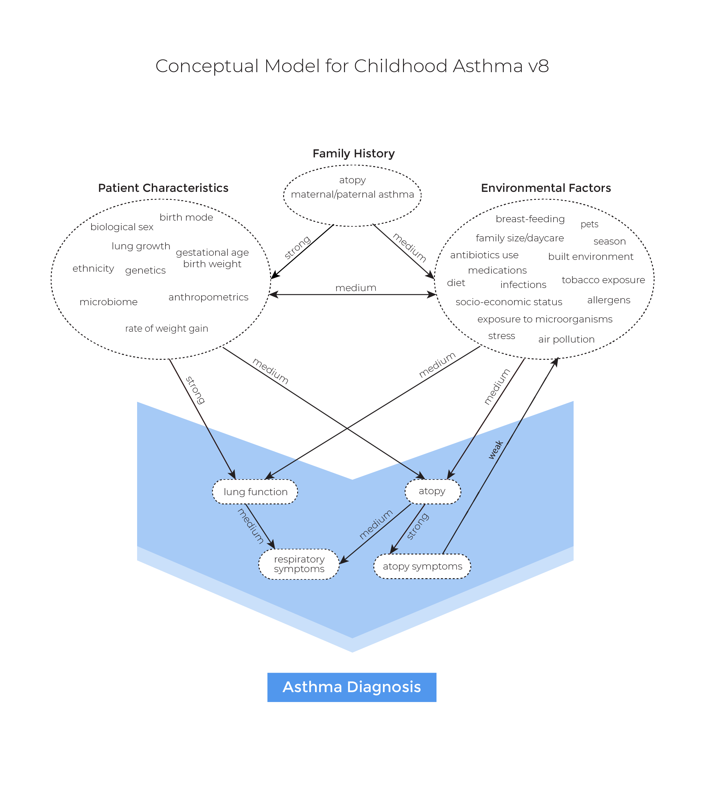

# Conceptual framework
Similar to [Evaluation Platform In COPD](https://doi.org/10.1177/0272989X18824098) and [Whole Diesase Modeling of Oral Cancer](http://hdl.handle.net/2429/71051), we follow the [Whole Disease Modeling framework](https://scholar.google.com/scholar?hl=en&as_sdt=0%2C5&q=Whole+Disease+Modeling+to+Inform+Resource+Allocation+Decisions+in+Cancer%3A+A+Methodological+Framework&btnG=), in which we model the **entire** course of the disease, from pre-clinical status through a variety of possible events including asthma incidence, asthma exacerbation, and death, and allow multiple decision nodes to interact with each other over time. 

<!---TODO: This framework has several advantages over the conventional *piecewise* approach in which only a part of the disease course is modeled.--->

Furthermore, a whole-disease model can serve as a *reference* model. Customarily, a new computer model is developed to conduct the economic evaluation for each set of new health technologies or interventions. In recent years, this approach has been criticized for several reasons. First, the approach is inefficient, because sometimes different computer models are developed and used for the same disease of interest, resulting in loss of analytic resources. Next, such *de novo* models are likely to be inconsistent in terms of model structure, evidence, and underlying assumptions. There is increasing recognition that de novo models lack transparency, making them inaccessible to other researchers. At the same time, studies have shown potential sponsorship bias associated with de novo models (i.e. models are developed to produce favorable results for their sponsors). An alternative to such de novo modeling that can overcome the aforementioned issues is use of a reference model that can serve as a unified framework in which different interventions for the same disease can be evaluated. Not only does the reference model reduce the inefficiency and inconsistency problems, but it is also often developed independently of any specific evaluation question, thereby reducing the risk of sponsorship bias. The reference model must be transparent enough so that researchers can understand its model structure and assumptions and use it with confidence. 

To model the entire disease pathway, we needed a concept map. A major missing gap in the literature was a concept map of the early disease course. Led by a steering committee of economic modelers, allergists, and respirologists across Canada, a concept map was developed through a modified Delphi method by closely following the guidelines set by the ISPOR-SMDM Modeling Good Research Practices Task Force. Details can be found [here](https://www.medrxiv.org/content/10.1101/2020.12.15.20248275v2), and the concept map is provided below:

While it requires a signifcant amount of efforts and time to build a refernece model, we believe that long-term benefits are insurmountable. 
<!--- Below is what we imagine it be: [TODO: build a prototype] --->